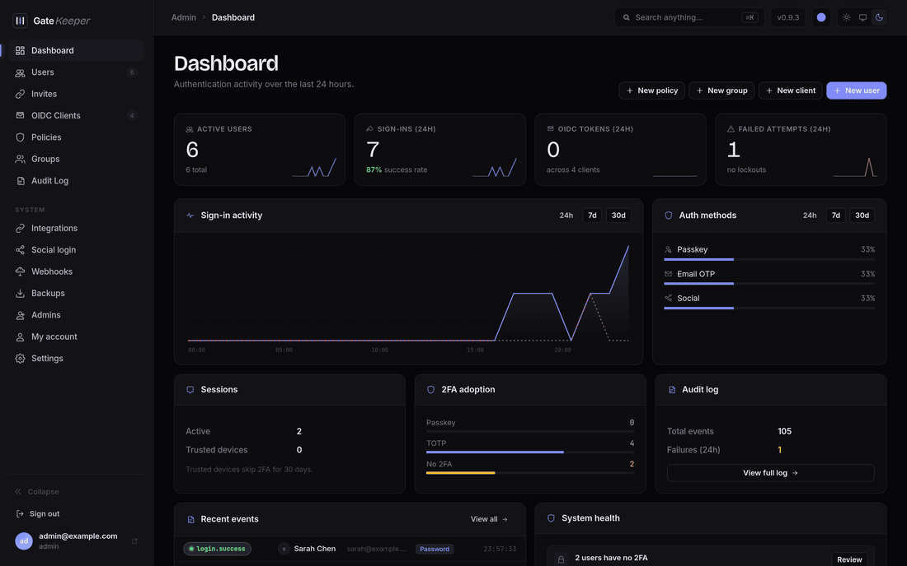

<div align="center">


# GateKeeper

**A lightweight, self-hosted authentication server.**<br>
Single Docker container, SQLite database, configured entirely through the admin UI.

[](https://github.com/chr0nzz/gatekeeper/actions/workflows/test.yml)
[](https://github.com/chr0nzz/gatekeeper/actions/workflows/docker.yml)
[](https://github.com/chr0nzz/gatekeeper/releases)
[](https://go.dev)
[](LICENSE)
[](https://gatekeeper.xyzlab.dev)
[](https://www.repo-grade.com/report/chr0nzz/gatekeeper)

[Documentation](https://gatekeeper.xyzlab.dev) &nbsp;·&nbsp;
[Installation](https://gatekeeper.xyzlab.dev/getting-started/installation) &nbsp;·&nbsp;
[Configuration](https://gatekeeper.xyzlab.dev/reference/env-vars) &nbsp;·&nbsp;
[Changelog](https://gatekeeper.xyzlab.dev/reference/changelog)

</div>

## What it does

- **OIDC identity provider** - any app that speaks OpenID Connect can delegate login to GateKeeper. Works with Grafana, Jellyfin, Portainer, and anything else that supports it.
- **ForwardAuth middleware** - protect apps at the reverse proxy without touching their code. Works with Traefik, Nginx, and Caddy. Credential injection signs users into apps that have no SSO support of their own.
- **Many ways to sign in** - password with an emailed code, passwordless email codes, authenticator apps, passkeys, QR code scanned from your phone, or GitHub, Google, and Discord.
- **Users, groups, and policies** - group membership is published as an OIDC claim for role mapping, and policies restrict which users reach which app.
- **Self-registration** - disabled, invite-only, open, or approval-required, with single-use invite links.
- **Encrypted backups** - scheduled snapshots to local storage or any S3-compatible object store, restored from the admin UI.
- **Webhooks and audit log** - an append-only record of every auth and admin event, with notifications to Discord, Slack, Telegram, ntfy, or any HTTP endpoint.
- **Admin UI for everything** - users, clients, policies, settings, and backups. No config files, no CLI.

## Screenshots

<div align="center">

<picture>
  <source media="(prefers-color-scheme: dark)" srcset="docs/public/screenshots/showcase-dark.gif">
  <source media="(prefers-color-scheme: light)" srcset="docs/public/screenshots/showcase-light.gif">
  
</picture>

<sub>Dashboard · Users · OIDC clients · Audit log · Settings · Sign-in</sub>

</div>

Every page follows your theme. The full [screenshot gallery](https://gatekeeper.xyzlab.dev/screenshots) covers the user portal, policies, groups, and backups too.

## Quick start

```yaml
services:
  gatekeeper:
    image: ghcr.io/chr0nzz/gatekeeper:latest
    restart: unless-stopped
    environment:
      BASE_URL: https://auth.example.com
      ADMIN_URL: https://admin.auth.example.com
      SECRET_KEY: your-64-char-hex-secret
    volumes:
      - gatekeeper_data:/data
    ports:
      - "8282:8282"
      - "8283:8283"

volumes:
  gatekeeper_data:
```

Generate a secret key with `openssl rand -hex 32`.

Port `8282` serves login, OIDC, and ForwardAuth. Port `8283` serves the admin panel and should only be reachable from your private network. Visit your admin URL to create the first admin account; everything else is configured from there.

See [Installation](https://gatekeeper.xyzlab.dev/getting-started/installation) for the full walkthrough and [Environment variables](https://gatekeeper.xyzlab.dev/reference/env-vars) for every option.

## Security

Passwords are hashed with argon2id. Sessions, trusted-device tokens, invites, and password-reset tokens are stored hashed. TOTP secrets, injected credentials, and third-party secrets are encrypted with AES-256-GCM. OIDC tokens are signed RS256 with keys that rotate every 30 days, and PKCE is required.

Full detail in the [security documentation](https://gatekeeper.xyzlab.dev/security/overview). To report a vulnerability, see [SECURITY.md](SECURITY.md).

## Building from source

Requires Go 1.26 or newer. No CGO.

```bash
git clone https://github.com/chr0nzz/gatekeeper
cd gatekeeper
go build -o gatekeeper ./cmd/gatekeeper
go test ./...
```

## Contributing

Contributions are welcome. See [CONTRIBUTING.md](CONTRIBUTING.md) for development setup, project conventions, and how changes are reviewed.

## License

See [LICENSE](LICENSE).
